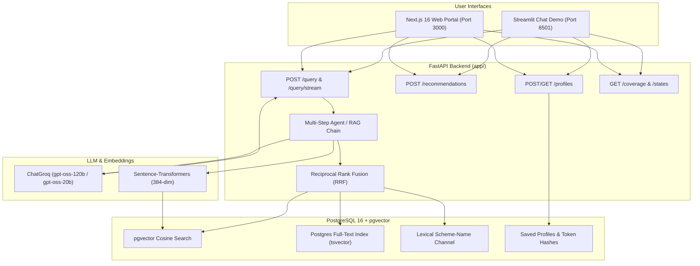

# SchemeGPT 🇮🇳

[](https://www.python.org/downloads/)
[](https://fastapi.tiangolo.com/)
[](https://nextjs.org/)
[](https://github.com/pgvector/pgvector)
[](https://groq.com/)
[](https://www.docker.com/)
[](eval/retrieval_gate.py)
[](https://github.com/aditya0si/schemeGPT/actions/workflows/ci.yml)
[](https://github.com/aditya0si/schemeGPT/actions/workflows/eval.yml)

> **SchemeGPT** is an open-source, domain-specific Retrieval-Augmented Generation (RAG) and decision-support engine for Indian Government Schemes, Central Acts, and State/UT Public Welfare Directories. It combines three-channel hybrid retrieval — pgvector dense embeddings, PostgreSQL `tsvector` full-text search, and a lexical scheme-name channel — fused with Reciprocal Rank Fusion, with the final top-4 kept source-diverse (one chunk per document). It also provides exact quote verification and deterministic citizen profile matching. The platform serves bilingual (English & Hindi) query responses with source-bound quote verification that rejects mismatched citations.

---


*Figure: Real-time SSE streaming answers with inline quote verification, deterministic profile matching, and bilingual search.*

---

## 📌 Keywords & Technical Domain Tags

`RAG` · `Retrieval-Augmented Generation` · `AI Engineering` · `pgvector` · `Reciprocal Rank Fusion (RRF)` · `FastAPI` · `Next.js 16` · `Streamlit` · `Groq gpt-oss` · `LangChain` · `Sentence-Transformers` · `Indian Government Schemes` · `MyScheme India` · `Public Welfare AI` · `SSE Streaming` · `Quote Verification` · `Deterministic Retrieval Evaluation` · `Multi-Step Tool-Calling Agent` · `Bilingual NLP (English + Hindi)` · `Docker Compose`

---

## 📑 Table of Contents

- [Why SchemeGPT](#why-schemegpt)
- [Quick Numbers](#quick-numbers)
- [Key Features](#key-features)
- [Comparison: Naive RAG vs SchemeGPT](#comparison-naive-rag-vs-schemegpt)
- [Sample Query & Verification Trace](#sample-query--verification-trace)
- [System Architecture & RAG Pipeline](#system-architecture--rag-pipeline)
- [Tech Stack](#tech-stack)
- [Repository Structure](#repository-structure)
- [API Endpoints Summary](#api-endpoints-summary)
- [Deployment](#deployment)
  - [Docker Compose One-Liner](#docker-compose-one-liner)
  - [Port Mappings](#port-mappings)
  - [Environment Variables](#environment-variables)
  - [Production VPS Runbook](#production-vps-runbook)
- [Field Operations](#field-operations)
  - [Preflight a host](#preflight-a-host)
  - [Build an air-gap bundle](#build-an-air-gap-bundle)
  - [Install, upgrade, roll back](#install-upgrade-roll-back)
  - [Operate a running deployment](#operate-a-running-deployment)
  - [Rehearse the failure modes](#rehearse-the-failure-modes)
- [Local Development](#local-development)
- [Groq API Key & Demo Fallback](#groq-api-key--demo-fallback)
- [Evaluation Suite](#evaluation-suite)
- [Smoke Verification](#smoke-verification)
- [Operational Disclaimers](#operational-disclaimers)
- [Roadmap](#roadmap)
- [License](#license)

---

## Why SchemeGPT

Indian government welfare schemes are fragmented across 30+ central ministry portals and state department websites, creating massive discovery friction for eligible citizens. Overlapping eligibility conditions, dense administrative terminology, and regional language barriers frequently prevent qualifying beneficiaries from claiming entitlements. SchemeGPT solves this by unifying official guidelines into an engineered RAG pipeline that verifies every claim against indexed source text.

---

## Quick Numbers

- **~2,100 scheme records**: 6 hand-verified central schemes, 36 state/UT directory seeds, and 2,052 automated myScheme-portal imports (each labeled with its data_status — the system never blurs verified and imported records).
- **RRF hybrid retrieval**: Reciprocal Rank Fusion fusing dense `multilingual-e5-small` embeddings, PostgreSQL `tsvector` keyword search, and a lexical scheme-name channel into a source-diverse top-4 (one chunk per document).
- **Deterministic retrieval gate**: Required CI measures Hit@4 and MRR@4 across 16 source-labelled cases; live generation judging remains a separate manual experiment.
- **FastAPI + Next.js 16**: Asynchronous FastAPI service streaming Server-Sent Events to an editorial Next.js 16 frontend and Streamlit demo.
- **Bilingual EN/HI**: Native multi-lingual query understanding, cross-language vector retrieval, and localized UI controls.
- **Quote-verified answers**: Deterministic exact substring validation preventing fabricated clauses, amounts, or guidelines.
- **As-of answers (dated claims)**: Deterministic "what did this scheme say on <date>" answers over the rate ladders the corpus documents declare, returning the value in force on that date with the verbatim sentence it came from, and refusing outright — never substituting the current value — when the era cannot be established (79 of 2,105 documents declare any date).
- **Operator control plane**: AI kill switch, provider circuit breaker, and runtime provider-endpoint override, so generation can be stopped, rerouted, or degraded to retrieval-only answers without taking the service down (`GET /ops/status`).
- **Field deployment kit**: air-gap install bundle with checksums and signatures, host preflight doctor (TLS interception, clock skew, egress policy), upgrade with database+config snapshot, and a rehearsed automatic rollback (`deploy/field/`).

---

## Key Features

- **Hybrid RRF Search**: Fuses pgvector cosine search, PostgreSQL `tsvector` keyword search, and a lexical scheme-name channel with Reciprocal Rank Fusion, then keeps one chunk per source for a source-diverse top-4.
- **Exact Quote Verification**: Cross-references every generated statement against source Markdown chunks via strict substring matching.
- **As-Of Answers**: Resolves "the value in force on <date>" from the effective dates a source document declares, cites the verbatim span, names the replacement and its date, and refuses honestly rather than substituting a current value — without a language model and without a point-in-time copy of the corpus.
- **Multi-Step Agent Retrieval**: Executes iterative tool-calling sequences for comparative, multi-scheme, and constraint-heavy queries.
- **Deterministic Profile Matching**: Recommends applicable welfare programs based on demographic, income, occupational, and location parameters without ungrounded LLM guessing.
- **SSE Token Streaming**: Streams live answer tokens and intermediate agent search events via Server-Sent Events.
- **Retrieval Quality Gate**: Runs a secret-free production retrieval benchmark in required CI and rejects incomplete or below-floor runs.
- **Dual Client Interfaces**: Provides an editorial Next.js 16 web application alongside an interactive Streamlit demonstration interface.
- **Zero-Key Demo Fallback**: Returns indexed reference answers when external LLM endpoints are unavailable or unconfigured.

---

## Comparison: Naive RAG vs SchemeGPT

| Capability / Metric | Naive RAG Baseline | SchemeGPT Pipeline |
| :--- | :--- | :--- |
| **Retrieval Mechanism** | Single-index dense vector search (misses acronyms and exact scheme identifiers) | Three-channel RRF combining dense `multilingual-e5-small` vectors + PostgreSQL `tsvector` full-text search + a lexical scheme-name channel, returning one chunk per source |
| **Citation & Factuality** | Generative citations prone to hallucinated eligibility limits and benefit sums | Deterministic substring quote verification against indexed scheme documentation |
| **Complex Queries** | Single-turn context dump without multi-document synthesis | Multi-step agent loop with tool-based iterative retrieval and comparison |
| **Evaluation Gate** | Ad-hoc manual spot checking without CI quality regression tracking | Deterministic 16-case Hit@4/MRR@4 retrieval gate, plus manual complete-coverage LLM-judge experiments |
| **Multilingual Handling** | Standard English-only tokenization with degraded cross-lingual recall | Native bilingual vector space alignment and localized query normalization |
| **Streaming & Telemetry** | Monolithic blocking response with no step visibility | Real-time SSE streaming with inline agent execution telemetry and quote verification events |

---

## Sample Query & Verification Trace

### User Query
> *"Am I eligible for PM-KISAN if my family owns 1.5 hectares of cultivable land, and what is the annual financial benefit?"*

### Verified System Response
> **Eligibility Status:** Eligible (subject to standard exclusion criteria).
>
> **Details:** Small and marginal farmer families with combined landholdings up to 2 hectares qualify for PM-KISAN, provided no family member falls under institutional or statutory exclusion categories (e.g., income tax payees or constitutional post holders).
>
> **Financial Benefit:** The scheme provides **₹6,000 per year** per family, disbursed in **three equal four-monthly instalments of ₹2,000 each** via Direct Benefit Transfer (DBT).
>
> **Verified Source Quote:**
> - *"Under the PM-KISAN scheme, all landholding farmer families having cultivable landholding up to 2 hectares are provided financial benefit of Rs.6000/- per annum per family payable in three equal installments of Rs.2000/- each, every four months."* — [PM-KISAN Guidelines](https://pmkisan.gov.in/)

### Agent Execution Trace (JSON)

```json
{
  "query": "Am I eligible for PM-KISAN if my family owns 1.5 hectares of cultivable land, and what is the annual financial benefit?",
  "intent": "eligibility_and_benefits",
  "steps": [
    {
      "step": 1,
      "tool": "hybrid_search",
      "args": { "query": "PM-KISAN land eligibility benefit amount installment", "top_k": 5 },
      "results_count": 3,
      "top_rrf_score": 0.0328
    },
    {
      "step": 2,
      "tool": "verify_quotes",
      "args": { "source_doc": "pm-kisan.md" },
      "claims_extracted": 2,
      "quotes_verified": 2,
      "verification_status": "PASSED"
    }
  ],
  "model": "openai/gpt-oss-120b",
  "latency_ms": 742
}
```

---

## Measured Results

Reproduce these with the commands in `eval/` and `loadtest/`. CI uploads
machine-readable evaluation artifacts for each run; local live-run history is
intentionally git-ignored. Experiment context lives in
[`EXPERIMENTS.md`](EXPERIMENTS.md).

**Serving layer** (Locust, 25 concurrent users, 60 s, demo-mode SSE — full
`sources → token* → done` event sequences required for success): **860/860
streams succeeded, 0 failures, 14.5 streams/s, median 11 ms, p95 25 ms,
p99 51 ms** (`loadtest/RESULTS.md`).

**Retrieval quality:** `.github/workflows/eval.yml` runs a no-secret,
deterministic gate against 16 source-labelled English, Hindi, Hinglish, profile,
and jurisdiction cases. It exercises the production three-channel hybrid
retriever (dense pgvector + Postgres full-text + lexical scheme-name matching,
fused with RRF and kept source-diverse in the top-4) and fails on incomplete
coverage, retrieval errors, Hit@4 below 0.85, or MRR@4 below 0.60. The gate was
found to be **plan-dependent**: the lexical channel broke ties on unspecified
Postgres row order, so the same corpus, model and configuration returned both
0.875 and 0.8125. That was fixed by data-only tie-breaking, which exposed a
second defect: `_select_diverse` capped one chunk per *source string*, so a
scheme indexed twice (hand-verified `schemes/pm-kisan.md` and auto-imported
`myscheme/pm-kisan.md`) could spend two provenance slots and squeeze out the
verified copy. The diversity rule now caps one chunk per **logical document**
(basename, `(N)` duplicate suffix stripped) and promotes the highest-trust copy
by `data_status`, so the verified document is cited in preference to the
automated import. The now-reproducible measurement on the full ingested corpus
generation `7213926b8590933d...` (2,105 markdown files, ~20k chunks) is **Hit@4
0.875** and **MRR@4 0.796875** across 16/16 completed cases with 0 retrieval
errors, identical on 5 separate runs — **above the 0.85 floor, so the gate
PASSES**. The two remaining deterministic misses are the PM-SYM Hinglish and
unorganised-worker profile questions, neither of which has a lexical anchor. The
frozen measurement — the exact command, the corpus generation and chunk count,
the embedding model, the date, and an explicit statement of what is *not*
claimed — is recorded in
[`docs/evidence/RETRIEVAL-GATE.md`](docs/evidence/RETRIEVAL-GATE.md). Retrieval
quality remains a tracked metric, not a solved problem.

<!-- claims: tests=554 evidence=22 -->

**Generation quality (LLM judge):** live LLM judging is a manual experiment because
Groq's free-tier daily quota can make infrastructure failures look like quality
regressions. The previous framework report was incomplete (different metrics
had only 5–18 scores out of 20), so it is not presented as a valid baseline.
`python -m eval.run_eval --gate` now requires every selected row to be completely
scored with zero pipeline/evaluation errors before aggregate floors can pass.
The manual `Live generation quality experiment` workflow uploads the report, scores, and run
history; no generation baseline will be published until a full set completes. An
offline regression baseline over the archived 2026-09-01 live-run capture —
verifying that quoted text is an exact substring of the retrieved sources with
no key, database, or network — is recorded in
[`docs/evidence/OFFLINE-GENERATION.md`](docs/evidence/OFFLINE-GENERATION.md).

**PII detection and redaction (Phase 6a/6b/6c):** dependency-free, offline
recognizers for Aadhaar (Verhoeff-checked), PAN, GSTIN, IFSC, UPI ids, Indian
mobiles, and Devanagari-digit forms are regression-measured at recall/precision
1.000 on a synthetic corpus with deliberate negatives — a self-consistency
check, not a field result. On the synchronous `/query` path the recognizers now
feed a request-scoped reversible vault: identifiers in the question are replaced
with placeholders before the provider call and restored in the answer, and
PII-bearing requests bypass the semantic cache. `/query/stream` uses the same
vault behind a bounded overlap buffer (64-character hold-back) so an identifier
split across SSE chunks is still redacted; the held tail is discarded on error
or disconnect, never emitted. The frozen measurement, exact command, floors,
integration facts, and an explicit statement of what this does *not* measure
(free-text profile fields, and a streaming guarantee proven against a stubbed
provider rather than a real network audit) are recorded in
[`docs/evidence/PII-BENCHMARK.md`](docs/evidence/PII-BENCHMARK.md).

**Temporal (as-of) answers:** the deterministic "what did this scheme say on
<date>" path reads the effective-dated values a source document declares and
returns the one in force on the requested day, with the verbatim sentence it came
from and the value that superseded it — no language model, no historical copy of
the corpus. Its golden set is **derived, not hand-written**: 124 cases from 10
ladders, regenerable byte-identically from a frozen artifact of 41 claims. Every
consistency floor — as-of, boundary, supersession, refusal, and retrieval-gate
invariance — measures **1.000**, and era-mixing **0.000**; the retrieval gate
still reports 16/16 · Hit@4 0.875 · MRR@4 0.796875. The capability is
deliberately narrow and the limits are published with the numbers: only **79 of
2,105** documents declare any date (1,982 declare none), there is no
per-document revision chain, and the gate is a **consistency** check that proves
the code reflects the artifact, not that any ladder is correct. The frozen
measurement, the question → claim → verbatim-span → source provenance chain, a
worked FADCS example, and an explicit statement of the coverage ceiling are
recorded in [`docs/evidence/TEMPORAL-GATE.md`](docs/evidence/TEMPORAL-GATE.md).

**Cost engineering:** every LLM call is also a money event. Per-model token
usage is tracked on `/metrics` alongside a USD **cost ledger** (`cost.total`,
`cost.by_model`, `cost.per_request_avg`, `cost.unpriced_calls`) computed from a
static price table in `app/pricing.py`. Prices are Groq list rates per
1,000,000 tokens: `openai/gpt-oss-120b` at `$0.15` in / `$0.60` out and
`openai/gpt-oss-20b` at `$0.075` in / `$0.30` out (verified 2026-10-05;
provenance is recorded on each entry's `source`). The ledger is honest about its
limits: Groq's 50% prompt-cache and batch discounts are not modelled, so
cached or batched calls are over-reported at list price, and a model with no
price entry is counted in `unpriced_calls` rather than silently costed at zero.
The semantic cache serves paraphrased repeats without an LLM call (hit rate on
`/metrics`), invalidates entries when the verifier contract, embedding model,
answer model, answer-prompt version, or corpus generation changes, and
re-verifies quote flags on every hit. The per-IP token bucket (`RATE_LIMIT_RPM`,
default 20/min) keeps a public deployment inside the shared free-tier quota.

---

## System Architecture & RAG Pipeline


```mermaid
flowchart TD
    subgraph Clients["User Interfaces"]
        UI_Web["Next.js 16 Web Portal (Port 3000)"]
        UI_Streamlit["Streamlit Chat Demo (Port 8501)"]
    end

    subgraph API["FastAPI Backend (app/)"]
        EP_Query["POST /query & /query/stream"]
        EP_Rec["POST /recommendations"]
        EP_Prof["POST/GET /profiles"]
        EP_Cov["GET /coverage & /states"]
        Agent["Multi-Step Agent / RAG Chain"]
        RRF["Reciprocal Rank Fusion (RRF)"]
    end

    subgraph Engine["LLM & Embeddings"]
        Groq["ChatGroq (gpt-oss-120b / gpt-oss-20b)"]
        ST["Sentence-Transformers (384-dim)"]
    end

    subgraph Storage["PostgreSQL 16 + pgvector"]
        VecStore["pgvector Cosine Search"]
        FTS["Postgres Full-Text Index (tsvector)"]
        Lexical["Lexical Scheme-Name Channel"]
        ProfileDB["Saved Profiles & Token Hashes"]
    end

    UI_Web --> EP_Query & EP_Rec & EP_Prof & EP_Cov
    UI_Streamlit --> EP_Query & EP_Rec & EP_Prof & EP_Cov

    EP_Query --> Agent
    Agent --> ST
    ST --> VecStore
    Agent --> RRF
    RRF --> VecStore & FTS & Lexical
    Agent --> Groq
    Groq --> EP_Query
    EP_Prof --> ProfileDB
```

> **AI Engineering Deep-Dive:** The complete technical specification of the RAG pipeline, streaming protocol, quote verification algorithms, evaluation harness, and design trade-offs are documented in [`docs/AI-ENGINEERING.md`](docs/AI-ENGINEERING.md).

---

## Tech Stack

- **Backend Framework**: [FastAPI](https://fastapi.tiangolo.com/) (Python 3.12), Uvicorn, Pydantic v2
- **Vector Store & Database**: [PostgreSQL 16](https://www.postgresql.org/) with [pgvector](https://github.com/pgvector/pgvector) and the maintained `langchain-postgres` `PGVectorStore` adapter
- **LLM Engine**: [Groq API](https://console.groq.com/) using `openai/gpt-oss-120b` (synthesis) and `openai/gpt-oss-20b` (routing)
- **Embedding Model**: `intfloat/multilingual-e5-small` (384 dimensions, local PyTorch CPU execution)
- **Frontend Applications**:
  - **Next.js 16**: TypeScript, Tailwind CSS, React 19 (`web/`)
  - **Streamlit**: Python Chat UI (`streamlit_app.py`)
- **Evaluation Suite**: deterministic source-retrieval gate (`eval/retrieval_gate.py`) plus an optional provider-neutral LLM-judge experiment (`eval/run_eval.py`)
- **Containerization**: Docker, Docker Compose

---

## Repository Structure

```
SchemeGPT/
├── app/                      # FastAPI Backend Application
│   ├── main.py               # API endpoints, FastAPI router, CORS & metrics
│   ├── rag.py                # Core RAG pipeline, prompt templates & ChatGroq integration
│   ├── retrieval.py          # Hybrid vector + full-text + lexical scheme-name retrieval (RRF)
│   ├── agent.py              # Multi-step tool-calling comparative retrieval agent
│   ├── recommend.py          # Deterministic scheme recommendation engine
│   ├── profiles.py           # Saved citizen profile storage & security
│   ├── ingest.py             # Idempotent document ingestion & vector chunking
│   ├── stream.py             # Server-Sent Events (SSE) streaming handler
│   ├── quotes.py             # Sub-string quote verification & source mapping
│   ├── db.py                 # Postgres connection pool & pgvector setup
│   └── config.py             # Environment configuration & Pydantic settings
├── data/                     # Ingested Knowledge Base
│   ├── schemes/*.md          # Verified central scheme records (PM-KISAN, PM-JAY, etc.)
│   ├── states/*.md           # 36 State / UT directory seed markdown records
│   ├── scheme_catalog.json   # Catalog metadata & eligibility tags
│   └── india_states.json     # Official state/UT directory mapping
├── web/                      # Next.js 16 Web Portal Application
├── streamlit_app.py          # Interactive Streamlit Demo Chat Application
├── eval/                     # Retrieval and generation evaluation suite
│   ├── run_eval.py           # Evaluation runner with quality thresholds & reporting
│   └── questions.json        # Curated test evaluation dataset (English + Hindi)
├── loadtest/                 # Locust load test for the SSE endpoint (+ RESULTS.md)
├── docs/                     # Documentation & Specifications
│   ├── AI-ENGINEERING.md     # In-depth architectural & RAG design guide
│   ├── DEPLOY.md             # Hosted deployment runbook (Vercel + Fly.io + Neon)
│   └── data-operations.md    # Scheme catalog curation & verification workflow
├── scripts/                  # Helper scripts
│   ├── validate_data.py      # Dependency-free schema & directory validator
│   ├── fetch_myscheme.py     # Corpus expansion: myScheme portal dataset -> Markdown
│   ├── reembed.py            # Rebuild vectors after an embedding-model change
│   └── feedback_to_eval.py   # Curated user feedback -> candidate eval cases
├── .github/workflows/        # CI (tests, data validation, web build) + weekly eval gate
├── fly.toml                  # Fly.io deployment config for the API
├── EXPERIMENTS.md            # Run-by-run experiment log with config fingerprints
├── Dockerfile                # API container multi-stage build
├── docker-compose.yml        # Multi-container orchestration (DB, API, Web, Streamlit)
├── requirements.txt          # Production Python dependencies
└── README.md                 # Primary documentation
```

---

## API Endpoints Summary

| Endpoint | Method | Description | Auth Required |
| :--- | :--- | :--- | :--- |
| `GET /livez` | `GET` | Process liveness probe with no dependency I/O. | None |
| `GET /readyz` | `GET` | Traffic-readiness check for database, complete active corpus generation, and embedding-model compatibility. | None |
| `GET /health` | `GET` | Backwards-compatible database health check. | None |
| `POST /query` | `POST` | Primary hybrid-RAG endpoint returning source-bound verified quotes. | None |
| `POST /query/stream` | `POST` | SSE real-time streaming RAG answer output with step events. | None |
| `GET /states` | `GET` | List all 36 Indian States and Union Territories directory records. | None |
| `GET /coverage` | `GET` | Report total catalog coverage (verified schemes vs directory seeds). | None |
| `POST /recommendations`| `POST` | Generate profile-matched scheme recommendations deterministically. | None |
| `POST /profiles` | `POST` | Create a saved citizen profile and receive an access token. | None |
| `GET /profiles/{id}` | `GET` | Retrieve saved citizen profile by ID. | Header: `X-Profile-Token` |
| `PUT /profiles/{id}` | `PUT` | Update saved citizen profile. | Header: `X-Profile-Token` |
| `DELETE /profiles/{id}`| `DELETE` | Delete saved citizen profile. | Header: `X-Profile-Token` |
| `POST /ingest` | `POST` | Trigger re-ingestion of `data/schemes` & `data/states` vectors. | Header: `X-Admin-Token` |
| `GET /ops/status` | `GET` | Operator snapshot: AI switch state, provider circuit breaker, degraded-answer counters, masked provider endpoint. | None |
| `POST /ops/ai` | `POST` | Operator kill switch: stop LLM generation for this instance and serve retrieval-only answers; the decision persists across restarts. | Header: `X-Admin-Token` |
| `POST /ops/provider` | `POST` | Repoint generation at another endpoint (customer API gateway, egress proxy, secondary provider) at runtime. | Header: `X-Admin-Token` |
| `GET /ops/audit` | `GET` | Bounded, sanitized operator audit trail (who disabled generation, when, why). | Header: `X-Admin-Token` |
| `GET /metrics` | `GET` | Observability metrics: request counters, latency percentiles, semantic-cache hit rate, per-model token usage, and the USD cost ledger. | None |
| `POST /feedback` | `POST` | Thumbs-up/down rating on one answer; curated ratings grow the eval set (`scripts/feedback_to_eval.py`). | None |

---

## Deployment

### Docker Compose One-Liner

```bash
cp .env.example .env && docker compose up -d --build
```

### Port Mappings

| Service | Container Port | Host Port | Accessibility |
| :--- | :--- | :--- | :--- |
| **Next.js Web Portal** | `3000` | `3000` | Public / Web Browser |
| **Streamlit Demo UI** | `8501` | `8501` | Public / Web Browser |
| **FastAPI Backend** | `8000` | `127.0.0.1:8000` | Localhost / Internal Network |
| **PostgreSQL + pgvector** | `5432` | `5432` (internal) | Isolated Docker Network |

### Environment Variables

| Variable | Required | Default | Description |
| :--- | :--- | :--- | :--- |
| `GROQ_API_KEY` | Optional | `""` (Demo Mode) | Groq API key for `openai/gpt-oss-120b` synthesis (and `gpt-oss-20b` normalization). Blank falls back to demo mode. |
| `DATABASE_URL` | Yes | `postgresql://scheme:scheme@db:5432/schemegpt` | PostgreSQL connection string. |
| `ADMIN_TOKEN` | Optional | `""` (Disabled) | Secret token required for authenticated `POST /ingest`. |
| `STREAMLIT_API_URL` | No | `http://api:8000` | Internal API URL used by the Streamlit frontend container. |
| `API_URL` | No | `http://localhost:8000` | API base URL for the Next.js server-side proxy (`/api/chat/stream`, `/api/chat/feedback`) — the browser only talks to Next.js, so CORS stays closed. |

### Production VPS Runbook

1. **Host Firewall & Port Configuration**:
   ```bash
   sudo ufw allow 22/tcp
   sudo ufw allow 8501/tcp
   sudo ufw allow 3000/tcp
   sudo ufw enable
   ```
   *Note: Port 8000 (API) binds to `127.0.0.1` and Port 5432 (Postgres) remains internal to Docker.*

2. **System Requirements & CPU Optimization**:
   - Minimum: 2 GB RAM / 20 GB Disk. Recommended: 4 GB RAM (e.g. ARM Ampere instance).
   - CPU-only PyTorch build (`torch==2.6.0+cpu`) ensures lightweight memory footprint without GPU overhead.

3. **Database Backup & Restoration**:
   ```bash
   # Export snapshot
   docker compose exec db pg_dump -U scheme -d schemegpt > backup_schemegpt.sql
   # Restore snapshot
   docker compose exec -T db psql -U scheme -d schemegpt < backup_schemegpt.sql
   ```

---

## Field Operations

Everything above gets the stack running on a machine you control. This section is for the other case: a machine you *don't* control, a network that blocks egress, and a change that has to be reversible. The tooling lives in [`deploy/field/`](deploy/field/) and the runbook is [`docs/FIELD-DEPLOY.md`](docs/FIELD-DEPLOY.md); measured results from a full rehearsal are in [`docs/evidence/FIELD-DRILL.md`](docs/evidence/FIELD-DRILL.md).

### Preflight a host

```bash
python3 deploy/field/preflight.py --label "customer-prod-01" \
    --json deploy/field/reports/preflight-customer-prod-01.json
```

A stdlib-only doctor (no venv, no pip, no internet) with stable finding codes: Docker and Compose availability, disk/memory/CPU, port collisions, DNS and TCP egress to the registry and the model provider, **corporate TLS interception**, **clock skew measured against the provider's `Date` header**, `.env` key presence (values are never printed), images and corpus. `--airgap` mode reclassifies the expected offline findings as informational. Exit codes: `0` go, `1` blockers, `2` go with warnings.

### Build an air-gap bundle

```bash
bash deploy/field/bundle.sh --version v2.0.0 --sign
```

Images as tarballs plus `MANIFEST.json` (immutable image IDs and digests), `SHA256SUMS`, an optional detached RSA-3072 signature, and the install scripts. On the far side:

```bash
./verify.sh --signature   # checksums + signature, before anything is loaded
./install.sh --airgap     # verify, load, preflight, start, health-gate, smoke
```

`install.sh` refuses to start without a `.env` — secrets are never generated silently — and gates on `/health` **and** `/ops/status`, accepting a 404 there so this kit can upgrade *from* a build that predates the operator control plane.

### Install, upgrade, roll back

```bash
bash deploy/field/upgrade.sh --to-version v2.0.1     # snapshot, gate, smoke, auto-rollback
bash deploy/field/rollback.sh                         # back to the recorded previous version
```

An upgrade snapshots the database **and the environment file** (a release is code *and* configuration), pins the new image, gates on health *and* on a real `POST /query`, and compares the vector-store row count before and after — a migration that drops rows is a data incident no health check can see. Any failure triggers an automatic rollback of image and config, with both attempts recorded as JSON under `deploy/field/logs/`.

### Operate a running deployment

```bash
curl -s http://127.0.0.1:8000/ops/status     # AI state, circuit breaker, degraded counters
curl -s -X POST http://127.0.0.1:8000/ops/ai \
  -H "X-Admin-Token: $ADMIN_TOKEN" -H 'Content-Type: application/json' \
  -d '{"enabled": false, "reason": "pilot review", "actor": "oncall"}'
```

The kill switch stops generation and serves **retrieval-only answers**: the same endpoint, HTTP 200, `mode: "degraded"`, and an answer assembled from verbatim source excerpts whose citation lines are verified mechanically. No generated prose, no pretending, and the decision survives a restart. `/health` deliberately stays `ok` while generation is off — a human pressed a switch, so the container must not be restarted for it. The provider circuit breaker opens after repeated failures and stops calling a provider that is already failing, then recovers with a single probe.

### Rehearse the failure modes

```bash
python3 deploy/field/drill.py --phases A,B,C,D,E,F,G
```

Drives a real deployment through install, upgrade, a deliberately broken release (which must fail its gate and roll back by itself), the kill switch (including a container restart to prove persistence), a sustained provider outage against a local stub, and a no-egress window — writing measured results to `docs/evidence/FIELD-DRILL.md`. Nothing in the drill reaches a real provider: the stub is attached through `POST /ops/provider`, so it is deterministic and free.

---

## Local Development

1. **Configure Environment:**
   ```bash
   cp .env.example .env
   # Set GROQ_API_KEY if testing live LLM responses; change db host from 'db' to 'localhost'
   ```
2. **Setup Virtual Environment:**
   ```bash
   python -m venv .venv
   # Windows: .venv\Scripts\activate | Unix: source .venv/bin/activate
   pip install -r requirements.txt
   ```
3. **Start Database:**
   ```bash
   docker compose up -d db
   ```
4. **Run API & Web Services:**
   ```bash
   uvicorn app.main:app --reload --port 8000
   # In a separate terminal:
   streamlit run streamlit_app.py
   ```

---

## Groq API Key & Demo Fallback

The only external API dependency is Groq for LLM inference. Get a free key at [console.groq.com](https://console.groq.com).

- **Demo Fallback (No Key Required)**: When `GROQ_API_KEY` is omitted or empty, `/query` returns labeled sample responses (`"mode": "demo"`) for standard schemes (PM-KISAN, PM-JAY, PMAY-G, PM-SYM, Startup India, GST).
- **Live RAG Mode**: Adding a valid key enables real-time vector retrieval, agent tool execution, and dynamic answer synthesis.

---

## Evaluation Suite

Evaluation measures retrieval and generation quality against curated cases in `eval/questions.json`. Required CI uses secret-free Hit@4/MRR@4; the optional generation experiment uses the configured Groq judge model.

| Metric | Target Floor | Description |
| :--- | :--- | :--- |
| **Faithfulness** | `>= 0.85` | Ensures answer claims are directly grounded in retrieved context chunks. |
| **Answer Relevancy** | `>= 0.70` | Measures alignment between the user's question and generated response. |
| **Context Precision** | measured | LLM-judge estimate of how much retrieved context is relevant (no gate floor yet). |
| **Context Recall** | measured | LLM-judge estimate of whether context covers the reference answer (no gate floor yet). |

```bash
# Install production plus evaluation dependencies
pip install -r requirements.txt -r requirements-eval.txt

# Deterministic production-retrieval gate (no LLM key; database required)
python -m eval.retrieval_gate

# Optional live generation experiment (Groq quota applies)
python -m eval.run_eval --limit 5 --gate
```

Evaluation outputs are generated to:
- `eval/results/report.md`: Markdown summary report with aggregate scores and regression triage flags.
- `eval/results/scores.json`: Machine-readable score breakdown per evaluation sample.

---

## Smoke Verification

Run quick validation tests locally or on CI without external API dependencies:

```bash
# 1. Syntax & compilation check
python -m py_compile app/*.py streamlit_app.py scripts/*.py eval/*.py

# 2. Schema and state directory validation
python scripts/validate_data.py

# 3. Docker Compose configuration verification
docker compose config --quiet

# 4. Liveness and dependency readiness checks
curl http://localhost:8000/livez
curl http://localhost:8000/readyz
curl http://localhost:8000/coverage
```

---

## Operational Disclaimers

- **Coverage Transparency**: The knowledge base indexes all 36 state/UT jurisdictions via directory seeds (`directory_seed`) alongside central verified schemes (`sample_verified`). Directory seeds link directly to official portals; always consult official ministry channels for formal applications.
- **Privacy Design**: Saved profiles are identified by one-way SHA-256 token hashes. No government identity numbers (Aadhaar, PAN) should ever be entered into the system.
- **Informational Purpose**: SchemeGPT outputs are decision-support aids and do not constitute statutory legal advice or government guarantee of benefits.

---

## Roadmap

- [ ] Add WhatsApp and Telegram bot interfaces for conversational citizen queries
- [ ] Expand full-text coverage to 500+ state-level welfare scheme operational guidelines
- [ ] Implement OCR document pipeline for automated application form parsing
- [ ] Integrate Bhashini API for voice-driven regional Indian dialect translation
- [ ] Add automated eligibility checklist verification against anonymized user documents

---

## License

Distributed under the MIT License. See [`LICENSE`](LICENSE) for details.
